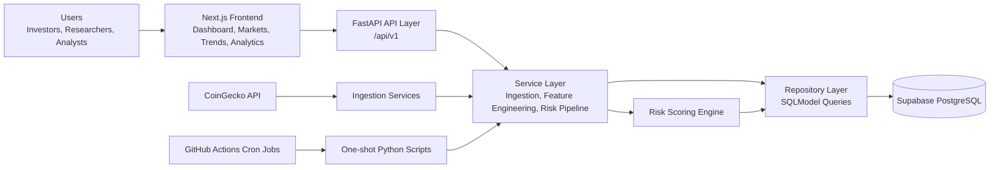
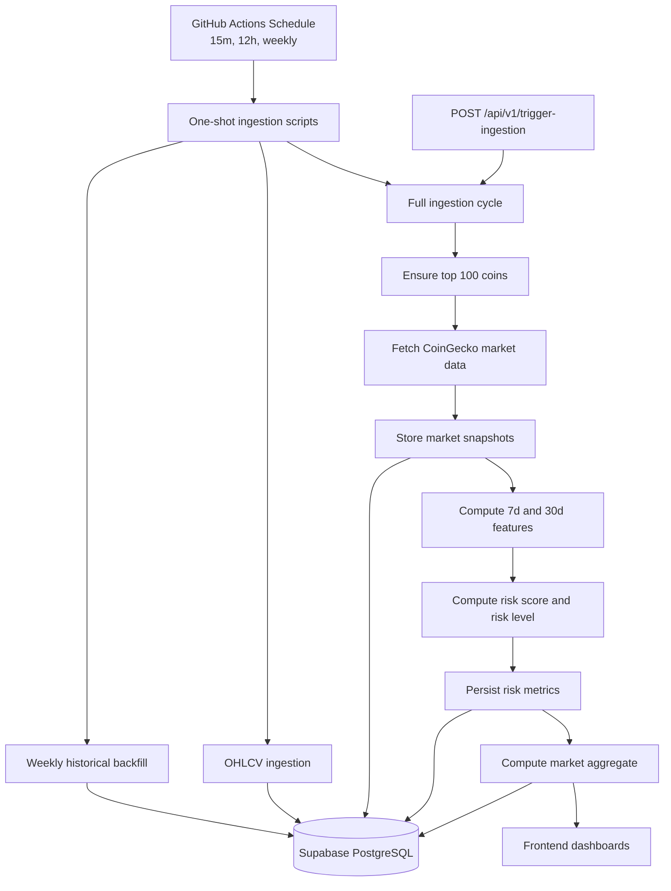
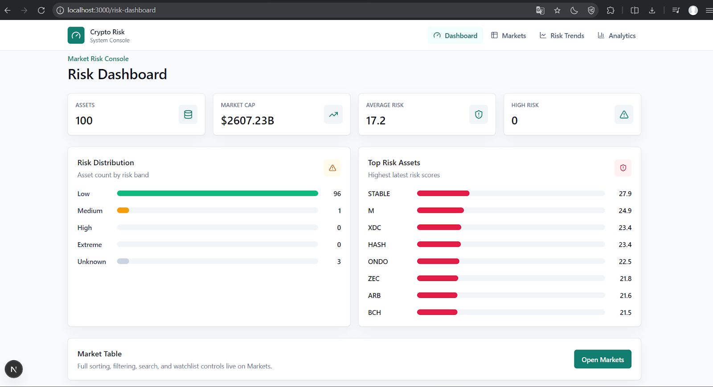
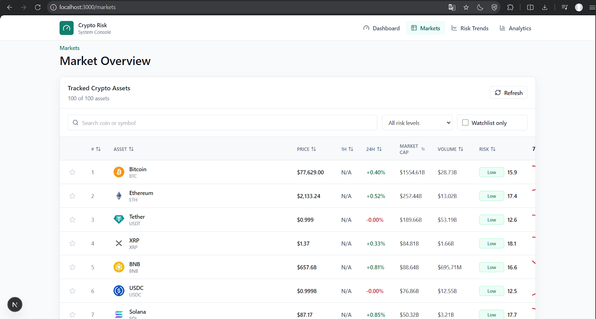
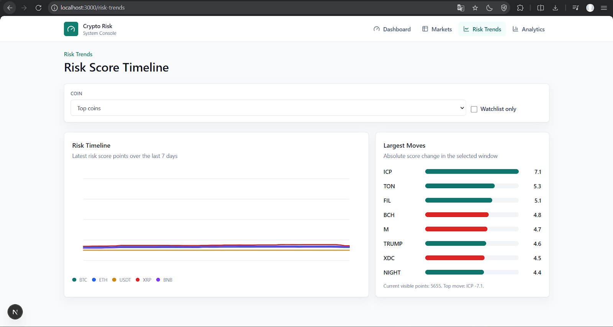
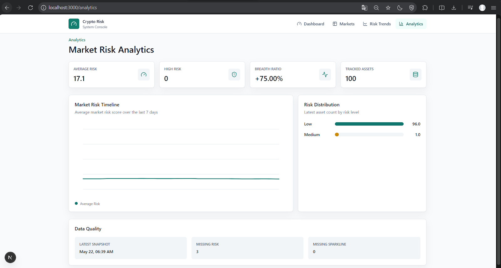

# Crypto Risk System


A full-stack crypto market risk analytics platform for monitoring prices, evaluating asset-level risk, and visualizing market trends for the top 100 cryptocurrencies by market capitalization from CoinGecko.

Built for individual investors, researchers, and crypto analysts who need a centralized view of short-term market risk, asset volatility, and data quality.

## Key Features

- **Risk Dashboard**: KPI cards, market risk summary, risk distribution, and top risky assets.
- **Markets View**: searchable and sortable market table with risk filters, price changes, volume, market cap, sparklines, and local watchlist controls.
- **Risk Trends**: risk score timeline with coin selection, watchlist filtering, and largest mover summaries.
- **Analytics**: market-wide risk timeline, risk distribution, breadth ratio, tracked asset count, and data quality indicators.
- **Risk Scoring Engine**: deterministic Python risk model using volatility, maximum drawdown, and average return.
- **Automated Pipelines**: scheduled GitHub Actions jobs for market ingestion, OHLCV ingestion, and weekly historical backfill.
- **Layered Backend**: FastAPI API layer, service orchestration layer, repository layer, and PostgreSQL database layer.

## System Architecture

Crypto Risk System is organized as a modular full-stack application:

- **Frontend**: Next.js App Router, TypeScript, TailwindCSS, shadcn-style UI primitives, TanStack Table, Recharts, and lucide-react icons.
- **Backend**: FastAPI application with SQLModel models and repository-driven database access.
- **Database**: Supabase PostgreSQL stores tracked coins, market snapshots, OHLCV candles, engineered features, risk metrics, and market aggregates.
- **Data Source**: CoinGecko API provides ranked market data, price history, volume data, and global market metadata.
- **Automation**: GitHub Actions runs one-shot ingestion scripts on cron schedules.

## Architecture Diagram



## Risk Scoring Methodology

The risk engine is implemented as pure Python functions in `app/services/risk_engine/risk_scorer.py`, making the model deterministic and unit-testable.

### Input Features

| Feature | Description |
| --- | --- |
| Volatility | Annualized standard deviation of log returns |
| Maximum Drawdown | Worst peak-to-trough decline over the price window |
| Average Return | Mean percentage return over the price window |

### Normalization

```text
norm_vol = (volatility - 0.0) / (3.0 - 0.0)
norm_dd  = drawdown
norm_ret = 1.0 - (avg_return + 0.5) / 1.0
```

Values are clamped to the `[0, 1]` range. Invalid volatility and drawdown values fail toward higher risk; invalid return values are treated as neutral.

### Formula

```text
risk_score = (
  0.40 * norm_vol +
  0.35 * norm_dd +
  0.25 * norm_ret
) * 100
```

### Risk Levels

| Score Range | Level |
| --- | --- |
| 0-25 | Low |
| 26-50 | Medium |
| 51-75 | High |
| 76-100 | Extreme |

## Data Pipeline Flow



## API Overview

All backend routes are mounted under `/api/v1`.

| Method | Endpoint | Description |
| --- | --- | --- |
| `GET` | `/api/v1/health` | Liveness check for the API service |
| `GET` | `/api/v1/market-risk` | Returns the latest market-wide aggregate risk metrics |
| `GET` | `/api/v1/coins/{coin_id}/risk` | Returns the latest risk metric for a coin UUID |
| `GET` | `/api/v1/top-risky-assets?limit=10` | Returns the highest-risk assets with coin metadata and latest market snapshot |
| `POST` | `/api/v1/trigger-ingestion` | Runs a synchronous market ingestion and risk computation cycle |

Interactive OpenAPI docs are available at:

```text
http://localhost:8000/docs
```

## Dashboard Screenshots

### Risk Dashboard



### Markets



### Risk Trends



### Analytics



## Project Structure

```text
crypto-risk-system/
├── .github/
│   └── workflows/
│       ├── market_ingestion.yml
│       ├── ohlcv_ingestion.yml
│       └── weekly_backfill.yml
├── app/
│   ├── api/
│   │   ├── deps.py
│   │   ├── main.py
│   │   └── routes/
│   │       ├── coin_risk.py
│   │       ├── health.py
│   │       ├── ingestion.py
│   │       ├── market_risk.py
│   │       └── top_risky.py
│   ├── core/
│   │   ├── config.py
│   │   └── db.py
│   ├── models/
│   │   ├── coin.py
│   │   ├── feature_metric.py
│   │   ├── market_aggregate.py
│   │   ├── market_snapshot.py
│   │   ├── ohlcv_candle.py
│   │   └── risk_metric.py
│   ├── repositories/
│   │   ├── aggregate_repository.py
│   │   ├── coin_repository.py
│   │   ├── feature_repository.py
│   │   ├── market_snapshot_repository.py
│   │   ├── ohlcv_repository.py
│   │   └── risk_repository.py
│   ├── services/
│   │   ├── feature_engineering/
│   │   ├── ingestion/
│   │   ├── risk_engine/
│   │   └── risk_pipeline_service.py
│   ├── worker/
│   │   └── scheduler.py
│   └── main.py
├── docs/
│   └── screenshots/
│       ├── analytics.png
│       ├── markets.png
│       ├── risk-dashboard.png
│       └── risk-trends.png
├── frontend/
│   ├── src/
│   │   ├── app/
│   │   │   ├── analytics/
│   │   │   ├── markets/
│   │   │   ├── risk-dashboard/
│   │   │   └── risk-trends/
│   │   ├── components/
│   │   ├── hooks/
│   │   ├── lib/
│   │   ├── services/
│   │   └── styles/
│   ├── package.json
│   ├── tailwind.config.ts
│   └── tsconfig.json
├── scripts/
│   ├── init_db.py
│   ├── run_backfill_once.py
│   ├── run_market_once.py
│   ├── run_ohlcv_once.py
│   └── run_worker.py
├── tests/
│   ├── test_feature_engineering.py
│   ├── test_risk_config_hash.py
│   └── test_risk_engine.py
├── apply_rls.py
└── pyproject.toml
```

## Installation Guide

### Prerequisites

- Python 3.11+
- Node.js 18+
- Supabase PostgreSQL project or another PostgreSQL database
- CoinGecko API access key, optional for local testing but recommended for scheduled runs

### Backend Setup

```bash
python -m venv .venv
source .venv/bin/activate
pip install -e ".[dev]"
```

On Windows PowerShell:

```powershell
python -m venv .venv
.\.venv\Scripts\Activate.ps1
pip install -e ".[dev]"
```

Create a `.env` file in the repository root:

```env
PROJECT_NAME="Crypto Risk System"
API_V1_STR="/api/v1"
ENVIRONMENT="local"
SECRET_KEY="change-this-for-deployments"

POSTGRES_SERVER="localhost"
POSTGRES_PORT="5432"
POSTGRES_USER="postgres"
POSTGRES_PASSWORD="postgres"
POSTGRES_DB="crypto_risk"
POSTGRES_SSL_MODE="disable"

COINGECKO_API_URL="https://api.coingecko.com/api/v3"
COINGECKO_API_KEY=""
COINGECKO_MAX_REQUESTS_PER_MINUTE="25"

RISK_WEIGHT_VOLATILITY="0.40"
RISK_WEIGHT_DRAWDOWN="0.35"
RISK_WEIGHT_RETURN="0.25"
RISK_MODEL_VERSION="1.0.0"

INGESTION_INTERVAL_MINUTES="15"
OHLCV_INTERVAL_HOURS="12"
BACKFILL_INTERVAL_DAYS="7"
AUTO_CREATE_TABLES="true"

BACKEND_CORS_ORIGINS="http://localhost:3000"
```

For Supabase, use the Supabase host, database, user, password, and `POSTGRES_SSL_MODE=require`. If using the Supabase transaction pooler on port `6543`, the backend automatically uses `NullPool`.

### Frontend Setup

```bash
cd frontend
npm install
```

Create `frontend/.env.local`:

```env
NEXT_PUBLIC_API_BASE_URL="http://localhost:8000/api/v1"
```

## Running the Project

Start the backend API:

```bash
uvicorn app.main:app --reload
```

Start the frontend:

```bash
cd frontend
npm run dev
```

Open:

```text
Frontend: http://localhost:3000
Backend:  http://localhost:8000
Docs:     http://localhost:8000/docs
```

Run a one-time ingestion cycle:

```bash
python scripts/run_market_once.py
```

Run the long-lived local worker:

```bash
python scripts/run_worker.py
```

The worker runs market ingestion, OHLCV ingestion, and weekly backfill loops using the intervals configured in `.env`.

## Automated Data Ingestion

The repository includes scheduled GitHub Actions workflows:

| Workflow | Schedule | Script | Purpose |
| --- | --- | --- | --- |
| `market_ingestion.yml` | Every 15 minutes | `scripts/run_market_once.py` | Fetch top-100 market data, compute risk metrics, and update market aggregates |
| `ohlcv_ingestion.yml` | Every 12 hours | `scripts/run_ohlcv_once.py` | Fetch 90-day market chart data and store OHLCV candles |
| `weekly_backfill.yml` | Sundays at 12:00 UTC | `scripts/run_backfill_once.py` | Refresh historical OHLCV data with deduplicated inserts |

Required GitHub repository secrets:

```text
POSTGRES_SERVER
POSTGRES_PORT
POSTGRES_USER
POSTGRES_PASSWORD
POSTGRES_DB
COINGECKO_API_KEY
```

The workflows validate database secrets before running and use `POSTGRES_SSL_MODE=require`, `ENVIRONMENT=production`, and `AUTO_CREATE_TABLES=false`.

## Testing

Run backend tests:

```bash
pytest
```

Run linting:

```bash
ruff check .
```

Run frontend type checking:

```bash
cd frontend
npm run typecheck
```

Run a production frontend build:

```bash
cd frontend
npm run build
```

The current Python test suite covers feature engineering, risk score normalization, risk classification boundaries, deterministic scoring behavior, and risk configuration hashing.

## Future Improvements

- Add authenticated user accounts and persistent server-side watchlists.
- Add historical API endpoints for true multi-point risk timelines instead of frontend-derived display series.
- Add alert rules for sudden risk score increases, extreme drawdowns, and market-wide risk spikes.
- Expand analytics with sector/category grouping and correlation analysis.
- Add Alembic migrations for controlled production schema changes.
- Add CI checks for backend tests, linting, frontend type checking, and frontend builds.
- Add a dedicated license file.

## License

No license file is currently included in this repository. Add a `LICENSE` file before distributing, publishing, or reusing the project outside a portfolio or private showcase context.
